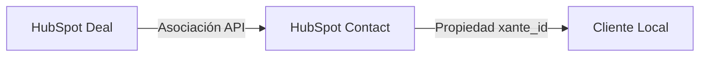

# Análisis del Sistema de Sincronización HubSpot

Este documento detalla cómo funciona la sincronización entre HubSpot y el sistema local, enfocándose en la integridad de los datos y la relación entre Deals (Negocios) y Clientes.

## 1. Criterio de Entrada (El "Gatekeeper")

El sistema tiene un filtro estricto para iniciar cualquier sincronización. **Solo se procesan los Deals que cumplen con:**

*   **Propiedad:** `estatus_de_convenio`
*   **Valor:** `'Aceptado'`

Esto se valida en dos niveles:
1.  **En la consulta a la API:** Se solicitan a HubSpot *únicamente* los deals con este estado.
2.  **En el procesamiento:** Se verifica nuevamente por código antes de procesar cualquier dato.

> **Conclusión:** Si un deal no está "Aceptado", el sistema lo ignora completamente. No hay riesgo de sincronizar deals en negociación o perdidos.

## 2. Relación Deal - Cliente (La "Cadena de Confianza")

La sincronización no "adivina" a quién pertenece un deal. Sigue una cadena de relaciones estricta definida en HubSpot:

### Paso a Paso:

1.  **El Deal:** El sistema toma un Deal "Aceptado".
2.  **La Asociación:** Consulta a la API de HubSpot: *"¿Quiénes son los contactos asociados a este Deal?"*.
    *   *Seguridad:* Si no hay contactos asociados, se omite el deal.
3.  **El Contacto:** Toma el primer contacto asociado y busca su propiedad `xante_id`.
    *   *Seguridad:* Si el contacto no tiene `xante_id` válido, se omite el deal.
4.  **El Cliente Local:** Busca en la base de datos local un cliente que tenga ese `xante_id` (o el `hubspot_id` del contacto).

## 3. Integridad de Datos y Prevención de Cruce

¿Cómo aseguramos que los datos de Juan no terminen en el perfil de Pedro?

### Mecanismos de Seguridad:

1.  **Identificador Único (`xante_id`):** Es la llave maestra. El sistema confía en que el `xante_id` en HubSpot es correcto. Si el Deal A está asociado al Contacto con `xante_id: 123`, los datos *solo* pueden ir al cliente local con ID 123.
2.  **Asociación Directa:** No se busca por nombre ni por email (que podrían duplicarse o escribirse mal). Se usa la asociación interna de IDs de HubSpot.
3.  **Un Deal = Un Titular:** El sistema toma los datos del Deal y los asigna al cliente encontrado.
4.  **Cónyuge como Dato del Deal:** Los datos del cónyuge (`nombre_completo_conyuge`, etc.) se tratan como propiedades del Deal. Se guardan en la tabla `spouses` vinculada directamente al cliente titular.

### Flujo de Datos (Prioridad):

El sistema fusiona datos de dos fuentes, dando prioridad a la información específica del Deal:

1.  **Datos Base (Contact):** Nombre, Email, Teléfono (del registro de contacto).
2.  **Datos Específicos (Deal):** Sobrescriben a los anteriores si existen en el Deal.
    *   Ejemplo: Si el contacto dice "Juan Pérez" pero el Deal dice "Juan P. Martínez" (nombre legal para contrato), se guarda el del Deal.
    *   Datos financieros, dirección de la propiedad y datos del cónyuge vienen exclusivamente del Deal.

## 4. Conclusión del Análisis

El sistema es robusto porque **no establece relaciones por su cuenta**. Replica exactamente las relaciones que ya existen en HubSpot.

*   **¿Puede cruzarse la información?** Solo si en HubSpot el Deal está asociado al contacto incorrecto (error humano en el CRM). El sistema es un "espejo" fiel de HubSpot.
*   **¿Se sincronizan deals no aceptados?** No, el filtro es doble y estricto.

### Recomendación

Para mantener la integridad, el proceso operativo en HubSpot debe asegurar que:
1.  Cada Deal "Aceptado" tenga **un solo contacto titular** asociado.
2.  Ese contacto titular tenga su `xante_id` correcto.
