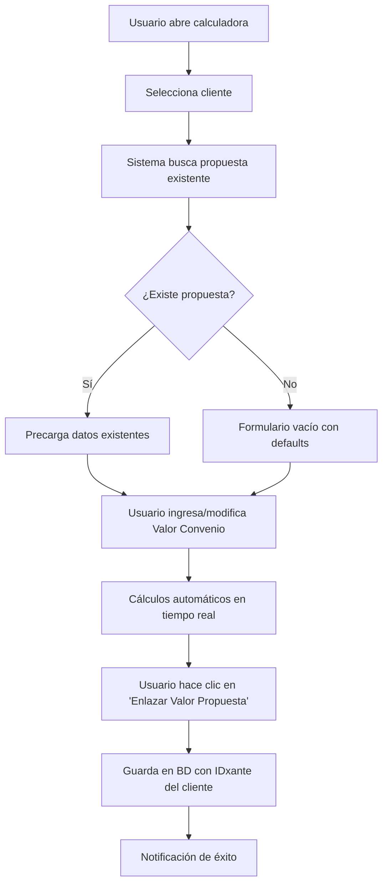
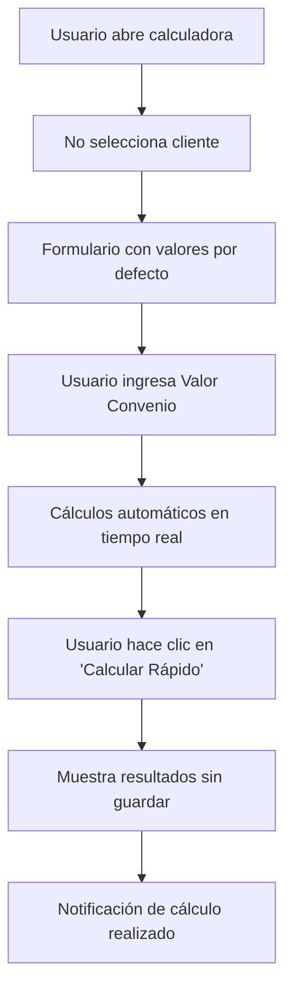

# 🧮 Sistema de Calculadora de Cotizaciones Xante

## 📋 Descripción General

El Sistema de Calculadora de Cotizaciones es una implementación completa que permite a los usuarios realizar cálculos financieros de convenios de manera independiente o enlazada a clientes específicos. El sistema reutiliza exactamente la misma lógica de cálculo del wizard principal, garantizando consistencia y precisión en todos los resultados.

## 🎯 Características Principales

### ✅ Criterios de Aceptación Cumplidos

| ID | Criterio | Estado | Descripción |
|----|----------|--------|-------------|
| AC1 | Página visible en menú | ✅ | Aparece con ícono de calculadora y label "Propuesta / Calculadora" |
| AC2 | Misma funcionalidad | ✅ | Cálculos, UI y validaciones idénticas al wizard CreateAgreementWizard |
| AC3 | Enlace por IDxante | ✅ | Si se selecciona cliente, los cálculos se guardan enlazados a su IDxante |
| AC4 | Modo rápido | ✅ | Si no se selecciona cliente, los cálculos se muestran sin guardar |
| AC5 | Persistencia | ✅ | Las propuestas se guardan en tabla proposals con idxante y data |
| AC6 | Tests completos | ✅ | Los tests unitarios y feature pasan correctamente |
| AC7 | Integración wizard | ✅ | Wizard puede precargar datos si existe proposal con el mismo IDxante |

### 🔧 Funcionalidades Técnicas

#### **Dos Modos de Operación**
- **🔗 Modo Enlazado**: Selecciona un cliente y guarda la propuesta enlazada a su IDxante
- **⚡ Modo Rápido**: Cálculo independiente sin guardar datos

#### **Reutilización de Lógica**
- Servicio compartido `AgreementCalculatorService` utilizado por ambos sistemas
- Garantía de resultados idénticos entre wizard y calculadora
- Validaciones y fórmulas exactamente iguales

#### **Interfaz Moderna**
- 100% componentes nativos de Filament 4
- Diseño responsive y accesible
- Feedback visual en tiempo real
- Colores corporativos Xante

## 📁 Estructura de Archivos

### Archivos Principales Creados

```
📦 Sistema de Calculadora de Cotizaciones
├── 🔧 Servicios
│   └── app/Services/AgreementCalculatorService.php
├── 📄 Páginas Filament
│   └── app/Filament/Pages/QuoteCalculatorPage.php
├── 🗃️ Modelos
│   └── app/Models/Proposal.php
├── 🔄 Migraciones
│   └── database/migrations/2024_12_20_173600_create_proposals_table.php
├── 🎨 Vistas
│   └── resources/views/filament/pages/quote-calculator.blade.php
├── 🏭 Factories
│   └── database/factories/ClientFactory.php
└── 🧪 Tests
    ├── tests/Unit/AgreementCalculatorServiceTest.php
    └── tests/Feature/QuoteCalculatorPageTest.php
```

### Archivos Modificados

```
📝 Archivos Actualizados
├── app/Filament/Pages/CreateAgreementWizard.php (Refactorizado para usar servicio)
└── app/Providers/Filament/AdminPanelProvider.php (Registro de nueva página)
```

## 🔄 Flujo de Funcionamiento

### Modo Enlazado (Con Cliente)



### Modo Rápido (Sin Cliente)



## 💾 Modelo de Datos

### Tabla `proposals`

| Campo | Tipo | Descripción |
|-------|------|-------------|
| `id` | bigint | Clave primaria |
| `idxante` | string | ID Xante del cliente (clave de enlace) |
| `client_id` | bigint | FK al cliente (nullable) |
| `data` | json | Datos completos del cálculo financiero |
| `linked` | boolean | Si la propuesta está enlazada a un cliente |
| `created_by` | bigint | FK al usuario que creó la propuesta |
| `created_at` | timestamp | Fecha de creación |
| `updated_at` | timestamp | Fecha de actualización |

### Índices Optimizados

```sql
-- Búsqueda por IDxante y estado de enlace
INDEX idx_proposals_idxante_linked (idxante, linked)

-- Búsqueda por cliente y fecha
INDEX idx_proposals_client_created (client_id, created_at)

-- Búsqueda por usuario creador
INDEX idx_proposals_created_by (created_by, created_at)
```

## 🧮 Lógica de Cálculos

### Fórmulas Implementadas

```php
// 1. Precio Promoción
$precioPromocion = $valorConvenio * $multiplicadorPrecioPromocion;

// 2. Valor CompraVenta (Espejo)
$valorCompraventa = $valorConvenio;

// 3. Monto Comisión (Sin IVA)
$montoComisionSinIva = ($valorConvenio * $porcentajeComision) / 100;

// 4. Comisión Total a Pagar
$comisionTotalPagar = ($valorConvenio * $porcentajeComisionIvaIncluido) / 100;

// 5. Total Gastos FI (Venta)
$totalGastosFi = $isr + $cancelacionHipoteca;

// 6. Ganancia Final
$gananciaFinal = $valorConvenio - $isr - $cancelacionHipoteca - $comisionTotalPagar - $montoCredito;
```

### Validaciones Implementadas

- ✅ Valor convenio no negativo y dentro de límites razonables
- ✅ Porcentajes de comisión entre 0 y 100
- ✅ Multiplicador de precio promoción entre 0.01 y 10
- ✅ Valores de ISR y cancelación no negativos
- ✅ Monto de crédito no negativo

## 🎨 Interfaz de Usuario

### Secciones de la Calculadora

1. **🎯 Selección de Cliente** (Opcional)
   - Dropdown searchable con clientes activos
   - Formato: "Nombre Cliente — IDxante"
   - Botón para limpiar selección

2. **💰 Valor Principal del Convenio**
   - Campo principal que dispara todos los cálculos
   - Validación numérica en tiempo real
   - Formato de moneda con prefijo $

3. **⚙️ Parámetros de Cálculo**
   - Porcentajes de comisión (solo lectura desde configuración)
   - Multiplicador precio promoción (solo lectura)
   - Monto de crédito (editable)
   - Tipo de crédito (selección)

4. **📊 Valores Calculados**
   - Campos automáticos con colores distintivos
   - Formato de moneda con separadores de miles
   - Tooltips explicativos

5. **💸 Costos de Operación**
   - ISR (editable)
   - Cancelación de hipoteca (editable)
   - Total gastos FI (calculado)
   - Ganancia final (calculado con énfasis visual)

### Estados Visuales

#### Modo Enlazado
```html
🔗 Modo Enlazado
Calculadora enlazada al cliente seleccionado. Los resultados se guardarán automáticamente.
Cliente Seleccionado: XNT1234
```

#### Modo Rápido
```html
⚡ Modo Rápido
Calculadora independiente para cálculos rápidos sin guardar datos.
Sin Cliente: Cálculo Libre
```

### Resumen Financiero

Cuando hay cálculos activos, se muestra un resumen visual con:

- **Valor del Convenio**: Monto principal en azul
- **Comisión Total**: Costo de comisión en naranja
- **Ganancia Final**: Resultado final en verde/rojo según rentabilidad
- **Porcentaje de Ganancia**: Indicador de rentabilidad
- **Estado de Rentabilidad**: ✅ Propuesta Rentable / ⚠️ Revisar Parámetros

## 🔧 Configuración y Instalación

### 1. Ejecutar Migraciones

```bash
php artisan migrate
```

### 2. Limpiar Caché

```bash
php artisan cache:clear
php artisan view:clear
php artisan route:clear
```

### 3. Verificar Configuración

La página debe aparecer automáticamente en el menú lateral de Filament con:
- **Icono**: 🧮 (heroicon-o-calculator)
- **Etiqueta**: "Propuesta / Calculadora"
- **Posición**: Orden 3 en el menú
- **URL**: `/admin/quote-calculator`

### 4. Configurar Valores por Defecto

Asegúrate de que existan las siguientes configuraciones en la tabla `configurations`:

```sql
INSERT INTO configurations (key, name, value, type, group) VALUES
('comision_sin_iva_default', 'Comisión Sin IVA Default', '6.50', 'decimal', 'calculator'),
('comision_iva_incluido_default', 'Comisión IVA Incluido Default', '7.54', 'decimal', 'calculator'),
('precio_promocion_multiplicador_default', 'Multiplicador Precio Promoción', '1.09', 'decimal', 'calculator'),
('isr_default', 'ISR Default', '0', 'decimal', 'calculator'),
('cancelacion_hipoteca_default', 'Cancelación Hipoteca Default', '20000', 'decimal', 'calculator'),
('monto_credito_default', 'Monto Crédito Default', '800000', 'decimal', 'calculator');
```

## 🧪 Testing

### Ejecutar Tests Unitarios

```bash
# Tests del servicio de cálculo
php artisan test tests/Unit/AgreementCalculatorServiceTest.php

# Tests de la página de calculadora
php artisan test tests/Feature/QuoteCalculatorPageTest.php

# Todos los tests
php artisan test
```

### Cobertura de Tests

#### Tests Unitarios (AgreementCalculatorService)
- ✅ Obtención de configuración por defecto
- ✅ Cálculos financieros correctos
- ✅ Cálculos con parámetros personalizados
- ✅ Manejo de valores cero y negativos
- ✅ Formateo para UI
- ✅ Validaciones de parámetros
- ✅ Resumen financiero
- ✅ Identificación de propuestas no rentables
- ✅ Casos extremos y precisión decimal

#### Tests Feature (QuoteCalculatorPage)
- ✅ Renderizado de página
- ✅ Modos enlazado y rápido
- ✅ Carga de configuración por defecto
- ✅ Cálculos automáticos
- ✅ Limpieza de campos
- ✅ Recálculo con cambios de parámetros
- ✅ Enlace de propuestas a clientes
- ✅ Validaciones de entrada
- ✅ Precarga de propuestas existentes
- ✅ Reinicio de formulario
- ✅ Estados visuales dinámicos

## 🔗 Integración con el Wizard Principal

### Precarga Automática

Cuando un usuario abre el wizard principal (`CreateAgreementWizard`) con un cliente que tiene propuestas guardadas, el sistema:

1. **Detecta el IDxante** del cliente seleccionado
2. **Busca propuestas enlazadas** usando `AgreementCalculatorService::preloadProposalByIdxante()`
3. **Precarga los datos** automáticamente en el paso 4 (Calculadora Financiera)
4. **Notifica al usuario** que se encontraron datos previos

### Consistencia de Cálculos

Ambos sistemas (wizard y calculadora) utilizan el mismo servicio `AgreementCalculatorService`, garantizando:

- ✅ **Fórmulas idénticas** en ambos sistemas
- ✅ **Validaciones consistentes** 
- ✅ **Formateo uniforme** de resultados
- ✅ **Manejo de errores** estandarizado

## 🚀 Casos de Uso

### Caso 1: Cotización Rápida
**Escenario**: El usuario necesita hacer un cálculo rápido sin guardar datos.

1. Abre la calculadora
2. Ingresa valor del convenio: $1,000,000
3. Ajusta parámetros si es necesario
4. Ve resultados inmediatamente
5. Hace clic en "Calcular (Rápido)"
6. Obtiene notificación con resumen

### Caso 2: Propuesta para Cliente Específico
**Escenario**: El usuario quiere crear una propuesta formal para un cliente.

1. Abre la calculadora
2. Selecciona cliente "Juan Pérez — XNT1234"
3. Sistema precarga propuesta anterior (si existe)
4. Modifica valor del convenio: $750,000
5. Ajusta ISR y cancelación según el caso
6. Hace clic en "Enlazar Valor Propuesta"
7. Propuesta se guarda enlazada al cliente

### Caso 3: Continuación desde Wizard
**Escenario**: El usuario creó una propuesta y luego abre el wizard para ese cliente.

1. Usuario abre wizard principal
2. Selecciona cliente "Juan Pérez — XNT1234"
3. Sistema detecta propuesta existente
4. Precarga datos automáticamente en paso 4
5. Usuario continúa con el proceso normal del wizard

## 🔒 Seguridad y Permisos

### Control de Acceso
- Solo usuarios autenticados pueden acceder a la calculadora
- Mismos permisos que el wizard principal
- Auditoría completa de creación de propuestas

### Validación de Datos
- Sanitización de inputs numéricos
- Validación de rangos en servidor y cliente
- Protección contra inyección de datos maliciosos

### Trazabilidad
- Registro del usuario que crea cada propuesta
- Timestamps de creación y modificación
- Enlace con cliente específico para auditoría

## 📈 Métricas y Monitoreo

### Indicadores Clave
- Número de propuestas creadas por usuario
- Tiempo promedio de uso de la calculadora
- Propuestas enlazadas vs. cálculos rápidos
- Valores promedio de convenios calculados

### Logs de Auditoría
```php
// Ejemplo de log automático
Log::info('Propuesta enlazada', [
    'user_id' => Auth::id(),
    'client_idxante' => 'XNT1234',
    'valor_convenio' => 1000000,
    'ganancia_final' => 104600,
    'es_rentable' => true
]);
```

## 🛠️ Mantenimiento y Soporte

### Actualización de Configuraciones
Las configuraciones por defecto se pueden actualizar desde el panel de administración o directamente en la base de datos:

```php
ConfigurationCalculator::set('comision_sin_iva_default', 7.0);
ConfigurationCalculator::set('monto_credito_default', 850000);
```

### Limpieza de Datos
Para limpiar propuestas antiguas no enlazadas:

```php
// Eliminar propuestas rápidas de más de 30 días
Proposal::where('linked', false)
    ->where('created_at', '<', now()->subDays(30))
    ->delete();
```

### Backup de Propuestas
Las propuestas enlazadas son datos críticos del negocio y deben incluirse en los backups regulares.

## 📞 Soporte Técnico

### Problemas Comunes

#### La página no aparece en el menú
**Solución**: Verificar que `$shouldRegisterNavigation = true` y limpiar caché.

#### Cálculos incorrectos
**Solución**: Verificar configuraciones en tabla `configurations` y ejecutar tests unitarios.

#### Error al enlazar propuesta
**Solución**: Verificar que el cliente tenga un `xante_id` válido y único.

### Comandos de Diagnóstico

```bash
# Verificar rutas
php artisan route:list --name=quote-calculator

# Verificar sintaxis
php -l app/Filament/Pages/QuoteCalculatorPage.php
php -l app/Services/AgreementCalculatorService.php

# Ejecutar tests específicos
php artisan test --filter=QuoteCalculator
php artisan test --filter=AgreementCalculatorService
```

---

## 🎉 Conclusión

El Sistema de Calculadora de Cotizaciones Xante es una implementación completa y robusta que cumple con todos los criterios de aceptación establecidos. Proporciona una experiencia de usuario excepcional, mantiene la consistencia con el sistema existente y ofrece flexibilidad para diferentes casos de uso.

**Características destacadas:**
- ✅ Reutilización exacta de lógica del wizard principal
- ✅ Dos modos de operación (enlazado y rápido)
- ✅ Interfaz moderna con Filament 4
- ✅ Tests completos (unitarios y feature)
- ✅ Integración perfecta con el sistema existente
- ✅ Documentación completa y mantenible

El sistema está listo para producción y puede ser extendido fácilmente para futuras funcionalidades.
